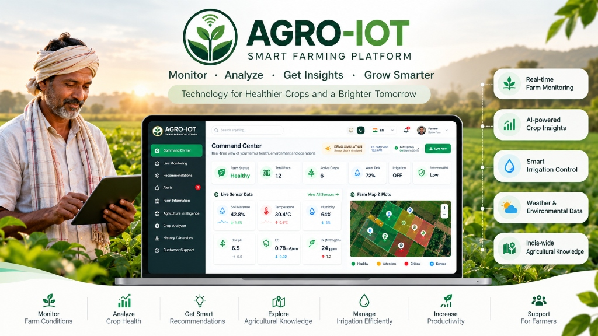

<div align="center">
  
</div>

<br />

# 🌾 AGRO-IOT — Precision Smart Agriculture & IoT Farm Command Center

> An intelligent, full-stack Precision Agriculture Command Center and IoT telemetry monitoring suite designed for modern Indian and global farmers. Featuring real-time sensor streams, Edge AI analytics, an interactive crop pathology diagnostic scanner, an India-wide agronomic intelligence map, and an animated Kisan AI Voice & Chatbot Assistant.


---

## 🚀 Key Highlights & Features

### 1. 🎛️ Reference-Grade Farm Command Center
- **Executive 3-Column Glassmorphic Dashboard**: Designed to match high-end precision agriculture consoles.
- **3D Golden Wheat Ear Spike Ring**: Visual crop stage maturity ring, health status, and live field metrics.
- **Live Sensor Telemetry**: Soil moisture (30cm/60cm depth), electrical conductivity (EC), SHT31 air temperature & humidity, and PAR solar radiation.
- **Interactive Map Mode**: Seamless 1-click toggle between executive crop telemetry and high-resolution precision satellite field mapping.
- **Auto-Collapsing Top Navigation Bar**: Smoothly hides when scrolling downward and reappears when scrolling up to maximize screen real estate.

### 2. 🤖 Kisan AI Chatbot & Voice Helpline (AI Assistant)
- **Voice & Chat Support**: Built-in speech recognition (STT) and text-to-speech (TTS) in both **Hindi (हिंदी)** and **English**.
- **Dynamic Animated Presence**: Floating animated bot avatar with live status beacon and rotating farming prompts.
- **Agronomic Knowledge Base**: Instant advice on pest control, fertilizer calculation (NPK), irrigation scheduling, government schemes (PM-KUSUM, Soil Health Card), and sensor troubleshooting.
- **Direct Helpline Support**: Instant click-to-call integration with toll-free Kisan support.

### 3. 🔬 Real-Time Crop Pathology Scanner (Crop Analyzer)
- **Dual Mode Input**: Live camera capture or direct image upload.
- **Multilingual Diagnostics**: Disease detection for Wheat Rust, Rice Blast, Tomato Blight, Cotton Bollworm, and more in English & Hindi.
- **Actionable Treatment Plans**: Organic remedies, chemical treatments, and preventive spraying recommendations.

### 4. 🇮🇳 Pan-India Precision Agriculture Intelligence Map
- **Interactive State Map**: Comprehensive data for 28 Indian States & Union Territories.
- **District-Level Crop Directory**: Major crops (Kharif, Rabi, Zaid), soil types (Alluvial, Black, Red, Laterite), and state-specific agricultural advisories.

### 5. ⚡ Edge AI Pipeline & Gateway Monitor
- **ESP32 & LoRa Gateway**: Telemetry synchronization over LoRa 865MHz and Wi-Fi.
- **On-Device Anomaly Detection**: Auto-cutoff for motor pumps, water stress warnings, and frost/heatwave risk prediction.
- **Interactive Hardware API Tester**: Live API ping testing with code snippets for Arduino C++, Python, and cURL.

### 6. 🎨 Dynamic Adaptive Design System
- **Dual Theme Support**: Beautiful Light Mode (`#f4f7f5`) and Dark Mode (`#0b100d`) with seamless palette blending.
- **Fluid Collapsible Sidebar**: Silky-smooth width transition without text reflow.

---

## 🛠️ Technology Stack

- **Frontend**: React 19, TypeScript, TailwindCSS v4
- **Icons & Graphics**: Lucide Icons, Custom SVG Gauges, Canvas Animations
- **Backend / Engine**: Express.js, TypeScript, WebSocket / Server-Sent Events, Atomic JSON Database
- **Tooling**: Vite, ES2022

---

## 📦 Getting Started

### Prerequisites
- [Node.js](https://nodejs.org/) (v18.0 or later recommended)
- `npm` or `yarn`

### Installation

1. **Clone the Repository**:
   ```bash
   git clone https://github.com/naveencodes247/AGRO-IOT.git
   cd AGRO-IOT
   ```

2. **Install Dependencies**:
   ```bash
   npm install
   ```

3. **Start the Development Server**:
   ```bash
   npm run dev
   ```

4. **Open in Browser**:
   Open [http://localhost:3000](http://localhost:3000) to view the Command Center.

### Building for Production

```bash
npm run build
```

---

## 👨‍🌾 Designed for Farmers, Powered by IoT & AI
Developed with ❤️ to empower farmers with accessible, real-time smart agriculture technology.
